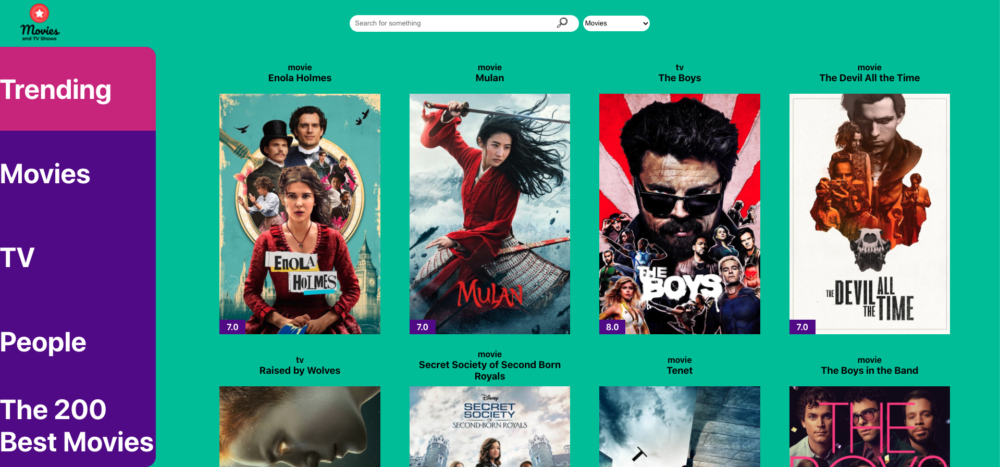

#Movie App

For this project, the public API provided by [The Movie DB](https://www.themoviedb.org/) was used in order to create a responsive application which is able to:

- Search for movies, tv show and celebrities
- Show the trendy movies and tv shows at a time;
- Show movies by genre selections
- Show tv shows by genre selections
- Show detailed information about a selected movie or show;
- Show celebrities and their biography;
- Provides a list including the 200 top ranked movies in the database;

The project was built with react using Context and Hooks. 

The styles is pure CSS, no external libraries.

To install the application run "npm i".

A functional version of the application can be find on my [portfolio page](fabemiliano.github.io)

The flat icons are free and provided by [Flat Icon](http://flaticon.com/)